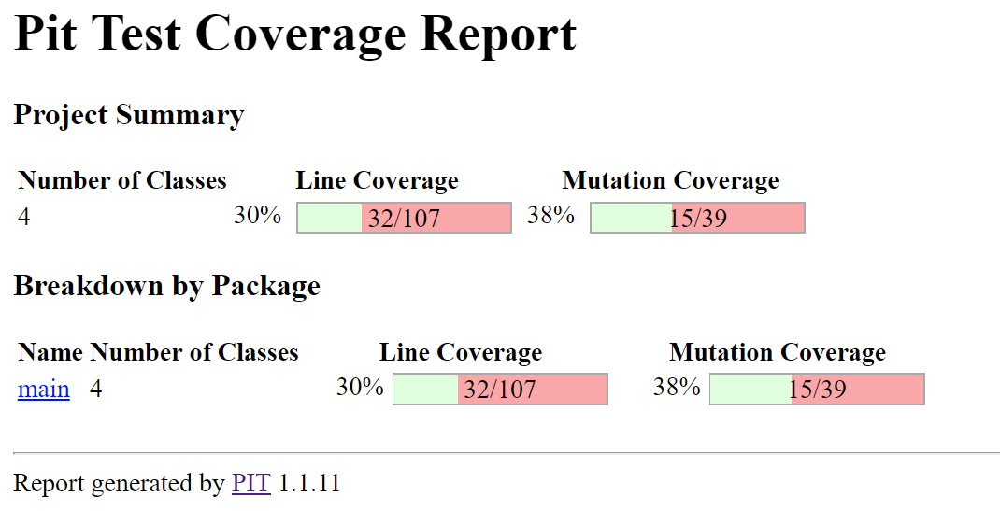
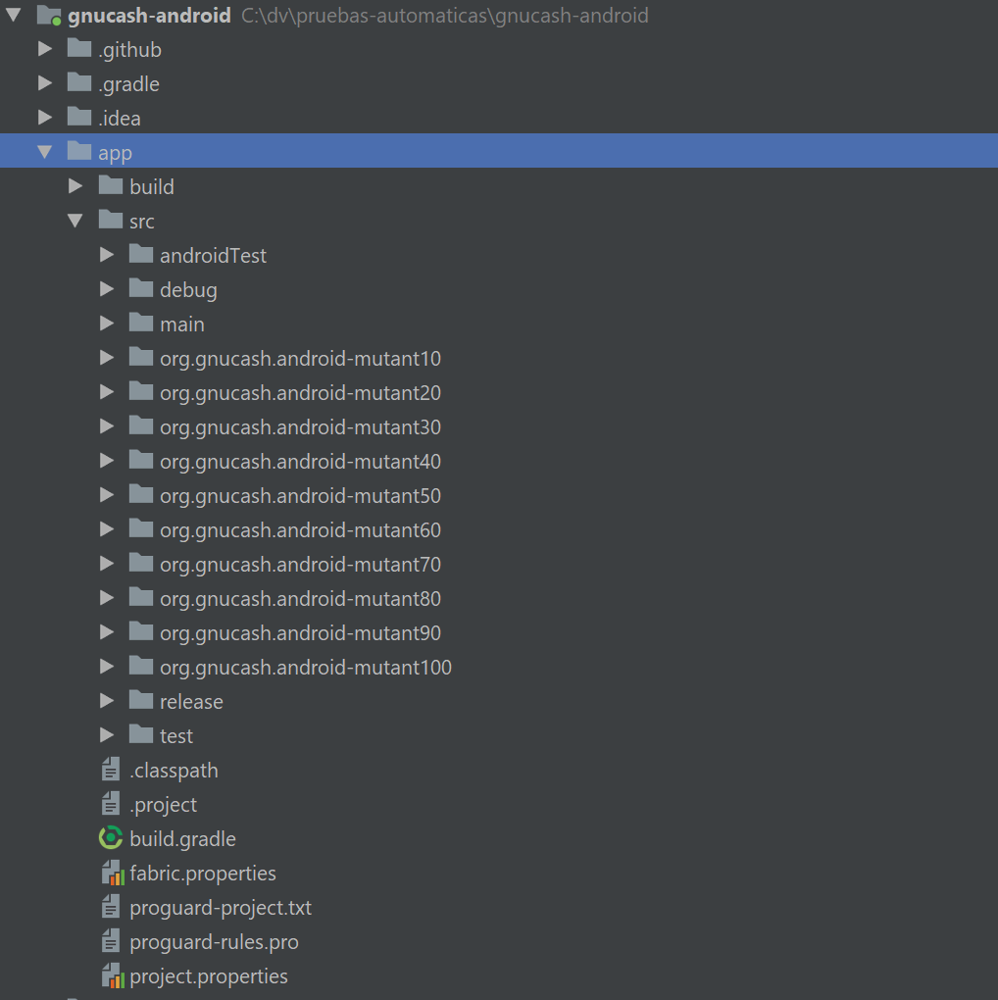
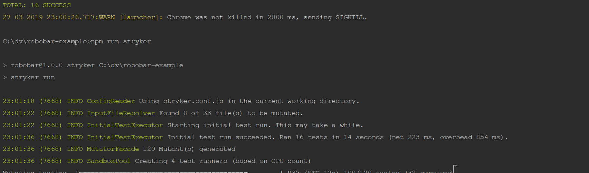
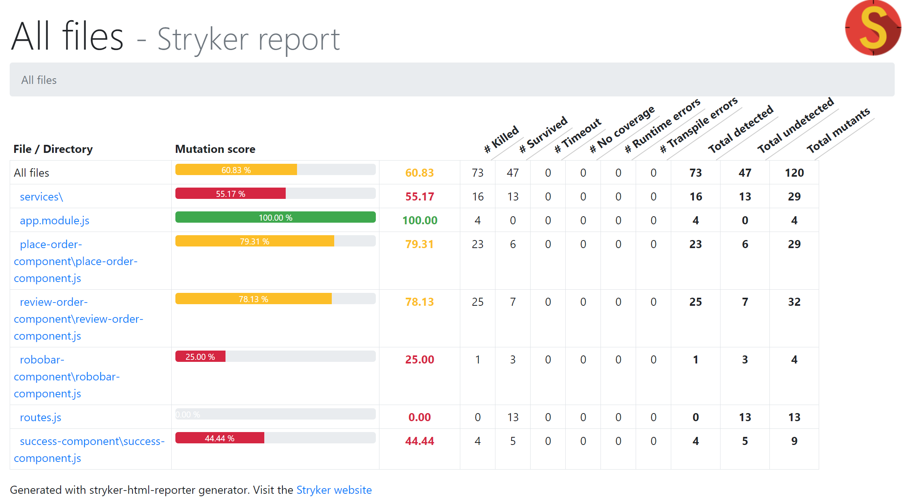
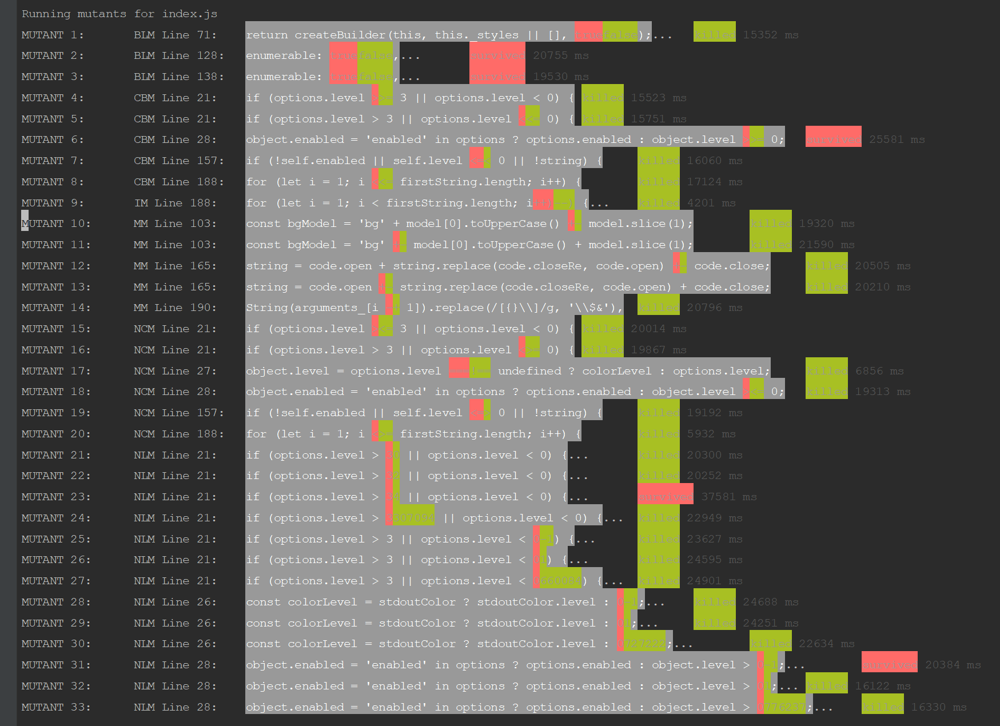

### Taller 8: Mutation Testing


#### 1. Pitest

<p align="center">
  
</p>


#### 2. MDROID+
```
java -jar target/MDroidPlus-1.0.0.jar libs4ast/ C:\dv\pruebas-automaticas\gnucash-android\app\src\main org.gnucash.android C:\dv\pruebas-automaticas\gnucash-android\tmp\mutants . true
```


<p align="center">
  
</p>

| Mutante                                | UNIT kill          | Monkey kill         | Tipo   |
| -------------------------------------  | ------------------ | ------------------- | -----  |
| app/src/org.gnucash.android-mutant10   | No                 |   No                | Mutant 10:  \src\main\java\org\gnucash\android\db\adapter\AccountsDbAdapter.java; ClosingNullCursor in line 1022|
| app/src/org.gnucash.android-mutant20   | No                 |   No                | Mutant 20:  \src\main\java\org\gnucash\android\db\adapter\CommoditiesDbAdapter.java; ClosingNullCursor in line 121|
| app/src/org.gnucash.android-mutant30   | No                 |   No                | Mutant 30:  \src\main\java\org\gnucash\android\db\adapter\PricesDbAdapter.java; ClosingNullCursor in line 124|
| app/src/org.gnucash.android-mutant40   | No                 |   No                | Mutant 40:  \src\main\java\org\gnucash\android\db\adapter\TransactionsDbAdapter.java; ClosingNullCursor in line 303|
| app/src/org.gnucash.android-mutant50   | No                 |   No                | Mutant 50:  \src\main\java\org\gnucash\android\db\MigrationHelper.java; ClosingNullCursor in line 371|
| app/src/org.gnucash.android-mutant60   | No                 |   No                | Mutant 60:  \src\main\java\org\gnucash\android\db\MigrationHelper.java; ClosingNullCursor in line 702|
| app/src/org.gnucash.android-mutant70   | No                 |   No                | Mutant 70:  \src\main\java\org\gnucash\android\ui\settings\AccountPreferencesFragment.java; ClosingNullCursor in line 84|
| app/src/org.gnucash.android-mutant80   | No                 |   No                | Mutant 80:  \src\main\java\org\gnucash\android\ui\account\AccountFormFragment.java; InvalidIDFindView in line 622|
| app/src/org.gnucash.android-mutant90   | No                 |   No                | Mutant 90:  \src\main\java\org\gnucash\android\ui\passcode\KeyboardFragment.java; InvalidIDFindView in line 109|
| app/src/org.gnucash.android-mutant100  | No                 |   No                | Mutant 100: \src\main\java\org\gnucash\android\ui\passcode\KeyboardFragment.java; InvalidIDFindView in line 85|


#### 3. Styker

En este punto debido a que no fé facil hacer funcionar stryker con las instrucciones del tutorial quizá por las versiones de la librería.

seguí un tutorial similar: https://github.com/stryker-mutator/robobar-example

La configuración es diferente:
```javascript
module.exports = function(config) {
    config.set({
        mutate: ["src/**/*.js"],
        mutator: "javascript",
        transpilers: [],
        reporters: ["html", "clear-text", "progress"],
        testRunner: "karma",
        testFramework: "jasmine",
        coverageAnalysis: "perTest",
        maxConcurrentTestRunners: 4,
        karma: {
            configFile: "test/config/karma.conf.js",
            config: {
                browsers: ["ChromeHeadless"]
            }
        }
    });
};
```

<p align="center">
  
</p>


<p align="center">
  
</p>


#### 4. Mutode
<p align="center">
  
</p>